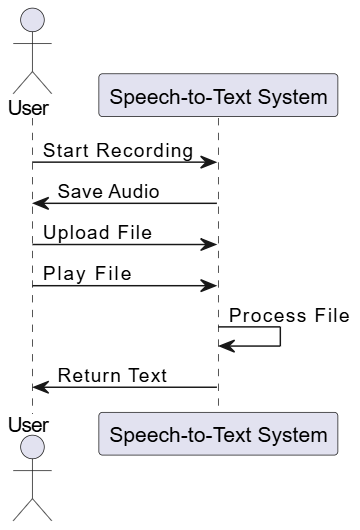

# Speech-to-Text System
___
This project is a Speech-to-Text application built with Python, designed to process audio files, perform transcription, and support functionalities such as recording, uploading, playing audio, and converting it to text.

## Features
1. Record Audio: Users can record audio directly through the interface. 
2. Upload Audio File: Users can upload an existing audio file for processing.
3. Play Uploaded Audio: The system allows users to listen to uploaded audio files.
4. Convert Audio to Text: Audio files are transcribed into text using state-of-the-art machine learning models.
## Technologies Used
This project leverages the following frameworks and libraries:

- FastAPI: For building a fast, modern, and asynchronous web API.
- Whisper: OpenAI's speech recognition model for transcription.
- Torch (PyTorch): For loading and running the Whisper model efficiently.
- Wave: For audio file manipulation and playback.